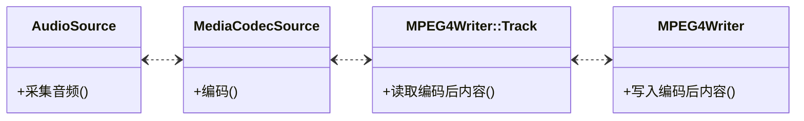

[TOC]

>本文首发地址 <https://blog.csdn.net/CSqingchen/article/details/134896808>  
>最新更新地址 <https://gitee.com/chenjim/chenjimblog>

## 前言
通过 [文2](https://h89.cn/archives/79.html)，我们知道 [MediaRecorder](https://developer.android.com/reference/android/media/MediaRecorder) 相关接口是在 StagefrightRecorder.cpp 中实现，本文进一步分析音频采集、编码、写入文件详细流程。

## 音频采集
### 音频初始化 
通过前文，我们知道 setupAudioEncoder 在 setupMPEG4orWEBMRecording 中初始化，相关源码如下    
```cpp
// frameworks/av/media/libmediaplayerservice/StagefrightRecorder.cpp
status_t StagefrightRecorder::setupAudioEncoder() {
    sp<MediaCodecSource> audioEncoder = createAudioSource();
    return OK;
}
sp<MediaCodecSource> StagefrightRecorder::createAudioSource() {
    ...
    // 通过 AVFactory 工厂创建 AudioSource,并初始化 
    sp<AudioSource> audioSource = AVFactory::get()->createAudioSource(
                &attr,
                mAttributionSource,
                sourceSampleRate,
                mAudioChannels,
                mSampleRate,
                mSelectedDeviceId,
                mSelectedMicDirection,
                mSelectedMicFieldDimension);

}
```
那 AudioSource 是如何初始化的呢  
```cpp
// frameworks/av/media/libstagefright/AudioSource.cpp
void AudioSource::set(const audio_attributes_t *attr, const AttributionSourceState& attributionSource,
        uint32_t sampleRate, uint32_t channelCount, uint32_t outSampleRate,
        audio_port_handle_t selectedDeviceId,
        audio_microphone_direction_t selectedMicDirection,
        float selectedMicFieldDimension)
{
    ...
    // 构造了 一个 AudioRecord cpp 对象  
    mRecord = new AudioRecord(
        AUDIO_SOURCE_DEFAULT, sampleRate, AUDIO_FORMAT_PCM_16_BIT,
        audio_channel_in_mask_from_count(channelCount),
        attributionSource,
        (size_t) (bufCount * frameCount),
        // 采集的音频数据回调 
        wp<AudioRecord::IAudioRecordCallback>{this},
        frameCount /*notificationFrames*/,
        AUDIO_SESSION_ALLOCATE,
        AudioRecord::TRANSFER_DEFAULT,
        AUDIO_INPUT_FLAG_NONE,
        attr,
        selectedDeviceId,
        selectedMicDirection,
        selectedMicFieldDimension);
   ...
}
```
[AudioRecord.java](https://developer.android.com/reference/android/media/AudioRecord) 底层的实现也是 AudioSource.cpp  
AudioRecord 主要是负责从麦克风设备采集音频 [PCM 帧](https://developer.android.com/reference/android/media/AudioFormat#ENCODING_PCM_16BIT)     

### AudioRecord 分析
```cpp
// frameworks/av/media/libaudioclient/AudioRecord.cpp
status_t AudioRecord::set(...) {
    ...
    if (mCallback != nullptr) {
        // 启动录制的线程 
        mAudioRecordThread = new AudioRecordThread(*this);
        mAudioRecordThread->run("AudioRecord", ANDROID_PRIORITY_AUDIO);
    }
    ...
}
bool AudioRecord::AudioRecordThread::threadLoop() {
    ...
    nsecs_t ns =  mReceiver.processAudioBuffer();
    ...
}

nsecs_t AudioRecord::processAudioBuffer() {
    ... 
    // 回调 AudioRecord::IAudioRecordCallback 
    if (newOverrun) {
        callback->onOverrun();

    }
    if (markerReached) {
        callback->onMarker(markerPosition.value());
    }
    while (newPosCount > 0) {
        callback->onNewPos(newPosition.value());
        newPosition += updatePeriod;
        newPosCount--;
    }
    if (mObservedSequence != sequence) {
        mObservedSequence = sequence;
        callback->onNewIAudioRecord();
    }

    while (mRemainingFrames > 0) {
        // 获取 audioBuffer 
        status_t err = obtainBuffer(&audioBuffer, requested, NULL, &nonContig);
        // 回调 取到的 buffer 到 AudioSource 中 onMoreData  
        const size_t readSize = callback->onMoreData(*buffer);
        // 释放 buffer 
        releaseBuffer(&audioBuffer);
    }
}
```
### AudioSource 采集到音频
```cpp
// frameworks/av/media/libstagefright/AudioSource.cpp
size_t AudioSource::onMoreData(const AudioRecord::Buffer& audioBuffer) { 
    ...
    // 将AudioRecord::Buffer 放入 MediaBuffer
    MediaBuffer *buffer = new MediaBuffer(audioBuffer.size());
    memcpy((uint8_t *) buffer->data(),
            audioBuffer.data(), audioBuffer.size());
    buffer->set_range(0, audioBuffer.size());
    // 将 buffer 放入缓存
    queueInputBuffer_l(buffer, timeUs);
    return audioBuffer.size();
}
void AudioSource::queueInputBuffer_l(MediaBuffer *buffer, int64_t timeUs) {
    ...
    // 将 buffer 放入缓存 mBuffersReceived 中
    mBuffersReceived.push_back(buffer);
    mFrameAvailableCondition.signal();
}

// 如下接口可以读取采集到的 buffer
status_t AudioSource::read(MediaBufferBase **out, const ReadOptions * /* options */) {
    ...
    MediaBuffer *buffer = *mBuffersReceived.begin();
    mBuffersReceived.erase(mBuffersReceived.begin());
    buffer->setObserver(this);
    ...
    *out = buffer;
}
```
## 音频编码 
编码器创建如下  
```cpp
sp<MediaCodecSource> StagefrightRecorder::createAudioSource() {
    sp<MediaCodecSource> audioEncoder = MediaCodecSource::Create(mLooper, format, audioSource);
}
// MediaCodecSource 构造如下  
MediaCodecSource::MediaCodecSource(
        const sp<ALooper> &looper,
        const sp<AMessage> &outputFormat,
        const sp<MediaSource> &source,
        const sp<PersistentSurface> &persistentSurface,
        uint32_t flags){
    if (!(mFlags & FLAG_USE_SURFACE_INPUT)) {
        // 将 AudioSource 放入 Puller 中
        mPuller = new Puller(source);
    }
}
```
MediaCodecSource::start 发送 kWhatStart 消息
```cpp
status_t MediaCodecSource::start(MetaData* params) {
    sp<AMessage> msg = new AMessage(kWhatStart, mReflector);
    msg->setObject("meta", params);
    // 发消息 kWhatStart 到 MediaCodecSource::onMessageReceived 
    // 进而传递到 MediaCodecSource::onStart 
    return postSynchronouslyAndReturnError(msg);
}
void MediaCodecSource::onMessageReceived(const sp<AMessage> &msg) {
    switch (msg->what()) {
        case kWhatStart: {
            sp<AMessage> response = new AMessage;
            // 调用 MediaCodecSource::onStart 
            response->setInt32("err", onStart(params));
            response->postReply(replyID);
        }
    }
}
status_t MediaCodecSource::onStart(MetaData *params) {
    ...
    // 创建 kWhatPullerNotify 消息,传入  MediaCodecSource::Puller::start 
    sp<AMessage> notify = new AMessage(kWhatPullerNotify, mReflector);
    err = mPuller->start(meta.get(), notify);
}
```
MediaCodecSource::Puller::start 流程如下 
```cpp
status_t MediaCodecSource::Puller::start(const sp<MetaData> &meta, const sp<AMessage> &notify) {
    mNotify = notify;
    // 发送 kWhatStart 消息 到 MediaCodecSource::Puller::onMessageReceived
    sp<AMessage> msg = new AMessage(kWhatStart, this);
    msg->setObject("meta", meta);
    return postSynchronouslyAndReturnError(msg);
}
void MediaCodecSource::Puller::onMessageReceived(const sp<AMessage> &msg) {
    switch (msg->what()) {
        case kWhatStart: {
            // start后，就开始 pull 
            schedulePull();
        }
        case kWhatPull:{
            // 通过上文的 AudioSource::read 读取采集到的数据
            status_t err = mSource->read(&mbuf);
            // 将读取到的 mbuf 放入队列 
            queue->pushBuffer(mbuf);

            if (mbuf != NULL) {
                // 送到 MediaCodecSource::onMessageReceived， 通知编码器 pull 到数据
                mNotify->post();
                // 继续 pull 
                msg->post();
            } else {
                // 结束 EndOfStream 
                handleEOS();
            }
        }
}
```
MediaCodecSource::Puller 读取到数据后，mNotify 发消息 kWhatPullerNotify 通知编码 
```cpp
void MediaCodecSource::onMessageReceived(const sp<AMessage> &msg) {
    switch (msg->what()) {
        case kWhatPullerNotify:{
            ...
            // 收到 通知，送去编码
            feedEncoderInputBuffers();
        }
    }
}
status_t MediaCodecSource::feedEncoderInputBuffers() {
    // 取数据编码
    while (!mAvailEncoderInputIndices.empty() && mPuller->readBuffer(&mbuf)) {
        ...
        // inbuf 送到编码器
        status_t err = mEncoder->getInputBuffer(bufferIndex, &inbuf);
        ...
        // 编码
        status_t err = mEncoder->queueInputBuffer(bufferIndex, 0, size, timeUs, flags);
    }
}
```
## 音频编码后数据处理
在创建编码器时，把 mEncoderActivityNotify 设置到编码器的 Callback，编码器的消息会通过 kWhatEncoderActivity 发送出来   
```cpp
status_t MediaCodecSource::initEncoder() {
    ...
    mEncoderActivityNotify = new AMessage(kWhatEncoderActivity, mReflector);
    mEncoder->setCallback(mEncoderActivityNotify);
    ...
}
```
当编码完成、状态变化，会收到 kWhatEncoderActivity 消息通知   
```cpp
void MediaCodecSource::onMessageReceived(const sp<AMessage> &msg) {
    switch (msg->what()) {
    case kWhatEncoderActivity:{
        if (cbID == MediaCodec::CB_INPUT_AVAILABLE) {
            // 输入不可用，继续给编码器送输入
        } else if (cbID == MediaCodec::CB_OUTPUT_FORMAT_CHANGED) {
            // 输出格式变化
        } else if (cbID == MediaCodec::CB_OUTPUT_AVAILABLE) {
            // 正常的输出数据
            // 获取编码器额输出
            status_t err = mEncoder->getOutputBuffer(index, &outbuf);
            // 将输出 buf 转  MediaBuffer
            MediaBuffer *mbuf = new MediaBuffer(outbuf->size());
            // 提取 MetaData
            sp<MetaData> meta = new MetaData(mbuf->meta_data());
            ...
            // 将 编码数据 outbuf 填充到 mbuf
            memcpy(mbuf->data(), outbuf->data(), outbuf->size());

            // 将编码后的数据添加到队列
            output->mBufferQueue.push_back(mbuf);
        } else if (cbID == MediaCodec::CB_ERROR) {
            // ERROR 异常，退出
            signalEOS(err);
        }
    }
    }
}
```
当需要数据时,从输出队列取数据即可  
```cpp
status_t MediaCodecSource::read(MediaBufferBase** buffer, const ReadOptions* /* options */) {
    Mutexed<Output>::Locked output(mOutput);

    *buffer = NULL;
    while (output->mBufferQueue.size() == 0 && !output->mEncoderReachedEOS) {
        output.waitForCondition(output->mCond);
    }
    if (!output->mEncoderReachedEOS) {
        *buffer = *output->mBufferQueue.begin();
        output->mBufferQueue.erase(output->mBufferQueue.begin());
        return OK;
    }
    return output->mErrorCode;
}
```

## MPEG4Writer写入音频编码后数据到文件  
通过如下源码，我们知道了 MPEG4Writer 创建和写入线程启动   
```cpp
status_t StagefrightRecorder::setupMPEG4orWEBMRecording() {
    ...
    writer = mp4writer = new MPEG4Writer(mOutputFd);
}
status_t StagefrightRecorder::start() {
    ...
    status = mWriter->start(meta.get());
}
status_t MPEG4Writer::start(MetaData *param) {
    ...
    err = startWriterThread();
    ...
    // 这个 startTracks 主要为 MPEG4Writer::Track 做准备 
    err = startTracks(param);
}
status_t MPEG4Writer::startWriterThread() {

    mDone = false;
    mIsFirstChunk = true;
    mDriftTimeUs = 0;
    // 将 音、视频 Track 添加到 mChunkInfos
    for (List<Track *>::iterator it = mTracks.begin();
         it != mTracks.end(); ++it) {
        ChunkInfo info;
        info.mTrack = *it;
        info.mPrevChunkTimestampUs = 0;
        info.mMaxInterChunkDurUs = 0;
        mChunkInfos.push_back(info);
    }
    ...

    // 启动线程执行 ThreadWrapper 
    pthread_attr_t attr;
    pthread_attr_init(&attr);
    pthread_attr_setdetachstate(&attr, PTHREAD_CREATE_JOINABLE);
    pthread_create(&mThread, &attr, ThreadWrapper, this);
    pthread_attr_destroy(&attr);
    return OK;
}
void *MPEG4Writer::ThreadWrapper(void *me) {
    MPEG4Writer *writer = static_cast<MPEG4Writer *>(me);
    // 最终执行的是 threadFunc()
    writer->threadFunc();
    return NULL;
}
```
写入线程开启后，一直循环，无数据时等待
```cpp
void MPEG4Writer::threadFunc() {

    Mutex::Autolock autoLock(mLock);
    while (!mDone) {
        Chunk chunk;
        bool chunkFound = false;
        
        // findChunkToWrite 从 mChunkInfos 找到需要写入的 Chunk
        while (!mDone && !(chunkFound = findChunkToWrite(&chunk))) {
            mChunkReadyCondition.wait(mLock);
        }

        // 在实时记录模式下，写时不按顺序持有锁, 减少媒体跟踪线程的阻塞时间。
        // 否则，保持锁，直到现有的块被写入文件。
        if (chunkFound) {
            if (mIsRealTimeRecording) {
                mLock.unlock();
            }
            // 写入 Chunk 
            writeChunkToFile(&chunk);
            if (mIsRealTimeRecording) {
                mLock.lock();
            }
        }
    }

    // 写入所有内存
    writeAllChunks();
}
```
写入到文件是在 writeChunkToFile 中完成  
```cpp
void MPEG4Writer::writeChunkToFile(Chunk* chunk) {
    while (!chunk->mSamples.empty()) {
        // 取一个 MediaBuffer 
        List<MediaBuffer *>::iterator it = chunk->mSamples.begin();
        ...
        // 写入 MediaBuffer 
        off64_t offset = addSample_l(*it, usePrefix, tiffHdrOffset, &bytesWritten);
        ...
    }
    // 写入后清空
    chunk->mSamples.clear();
}
off64_t MPEG4Writer::addSample_l(MediaBuffer *buffer, bool usePrefix,
        uint32_t tiffHdrOffset, size_t *bytesWritten) {
    ...
    writeOrPostError(mFd, (const uint8_t*)buffer->data() + buffer->range_offset(),
                         buffer->range_length());
}
void MPEG4Writer::writeOrPostError(int fd, const void* buf, size_t count) {
    ...
    // 真正的写入 buf 
    ssize_t bytesWritten = ::write(fd, buf, count);
    ...
    // IO 异常时 抛出 ，通过消息传递到上层  
    sp<AMessage> msg = new AMessage(kWhatIOError, mReflector);
    msg->setInt32("err", ERROR_IO);
}
```

## MPEG4Writer::Track 取编码后的音频编数据 
MPEG4Writer::Track 启动源码如下  
```cpp
status_t MPEG4Writer::startTracks(MetaData *params) {
    ...
    for (List<Track *>::iterator it = mTracks.begin();
         it != mTracks.end(); ++it) {
        // MPEG4Writer::Track  start 
        status_t err = (*it)->start(params);
        ...
    }
    return OK;
}
status_t MPEG4Writer::Track::start(MetaData *params) {
    ...
    // 启动线程执行 ThreadWrapper 
    pthread_create(&mThread, &attr, ThreadWrapper, this);
}
void *MPEG4Writer::Track::ThreadWrapper(void *me) {
    Track *track = static_cast<Track *>(me);
    status_t err = track->threadEntry();
    return (void *)(uintptr_t)err;
}
```
MPEG4Writer::Track::threadEntry 读取编码后的数据  
```cpp
status_t MPEG4Writer::Track::threadEntry() {
    // mSource->read 也就是 上文 MediaCodecSource::read ，一直不停的读取数据到 buffer  
    MediaBufferBase *buffer;
    while (!mDone && (err = mSource->read(&buffer)) == OK && buffer != NULL) {
        ...
        // 将 buffer 转为 MediaBuffer 
        MediaBuffer *copy = new MediaBuffer(buffer->range_length());
        if (sampleFileOffset != -1) {
            copy->meta_data().setInt64(kKeySampleFileOffset, sampleFileOffset);
        } else {
            memcpy(copy->data(), (uint8_t*)buffer->data() + buffer->range_offset(),
                   buffer->range_length());
        }
        ...
        // 将 copy 放入队列 mChunkSamples
        mChunkSamples.push_back(copy);
        ...
        // 将 mChunkSamples 转 为 Chunk
        bufferChunk(timestampUs);
    }
}
void MPEG4Writer::Track::bufferChunk(int64_t timestampUs) {
    Chunk chunk(this, timestampUs, mChunkSamples);
    // 也就是  MPEG4Writer::bufferChunk 
    mOwner->bufferChunk(chunk);
    mChunkSamples.clear();
}
void MPEG4Writer::bufferChunk(const Chunk& chunk) {
    Mutex::Autolock autolock(mLock);
    for (List<ChunkInfo>::iterator it = mChunkInfos.begin();
         it != mChunkInfos.end(); ++it) {
        if (chunk.mTrack == it->mTrack) {
            // 将 Chunk 放入 ChunkInfo.mChunks 中，
            it->mChunks.push_back(chunk);
            // 数据准备好了，通知 mChunkReadyCondition.wait 继续执行
            // 进而 由 findChunkToWrite 读取写入文件  
            mChunkReadyCondition.signal();
            return;
        }
    }
}
```

## 结语
到这里，已经完成了 MediaRecorder 音频采集、编码、写入文件详细源码分析。    
用一幅图概括如下  

希望对你有所帮助。如果你在使用MediaRecorder的过程中遇到了其他问题，欢迎留言讨论。    
如果你觉得本文还不错，可以点赞+收藏。


---

相关文章  
[安卓MediaRecorder(1)录制音频的详细使用](https://h89.cn/archives/77.html)  
[安卓MediaRecorder(2)录制源码分析](https://h89.cn/archives/79.html)  
[安卓MediaRecorder(3)音频采集编码写入源码分析](https://h89.cn/archives/116.html)  
[安卓MediaRecorder(4)视频采集编码写入源码分析](https://h89.cn/archives/124.html)  

